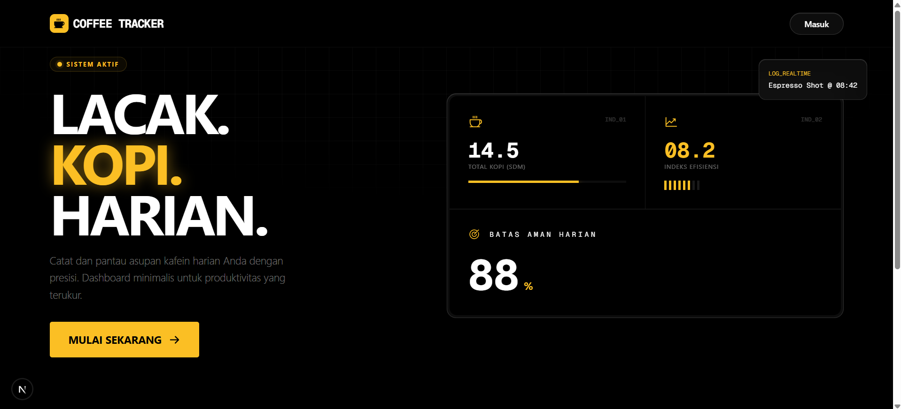
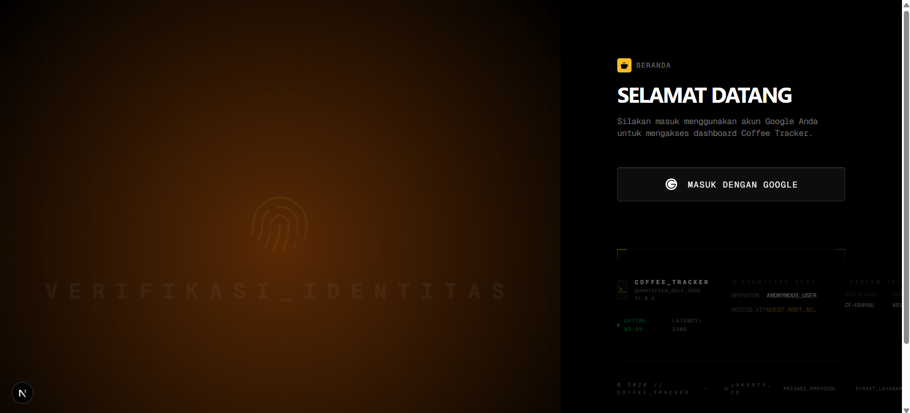
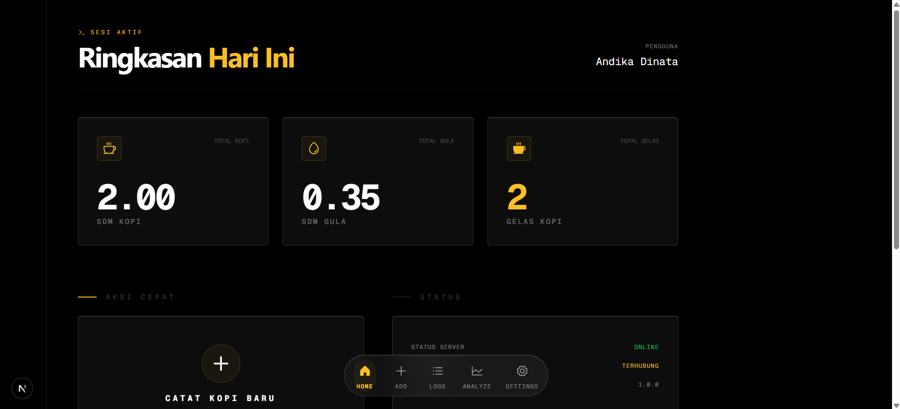

# Coffee Tracker

Coffee Tracker is a modern web application designed for enthusiasts to monitor and analyze their daily caffeine intake. Built with Next.js and Cloudflare, it offers a seamless experience for logging coffee consumption while providing insightful AI-driven analysis to help users understand their habits and optimize their energy levels.

The platform features a sleek, responsive interface with real-time statistics and interactive charts. Whether you're tracking your favorite brews or managing caffeine dependency, Coffee Tracker provides the tools you need to maintain a balanced lifestyle.

## Screenshots

